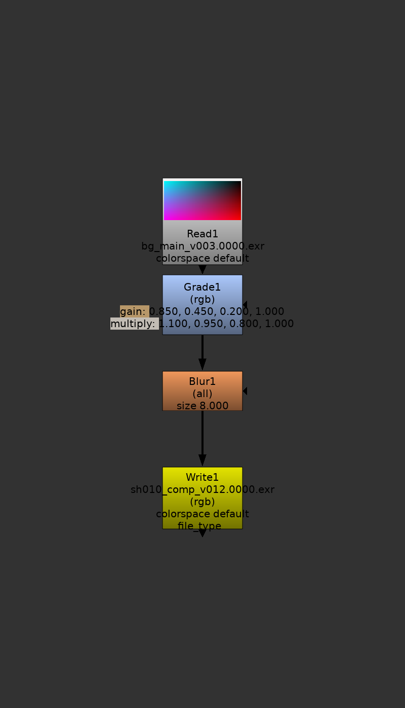
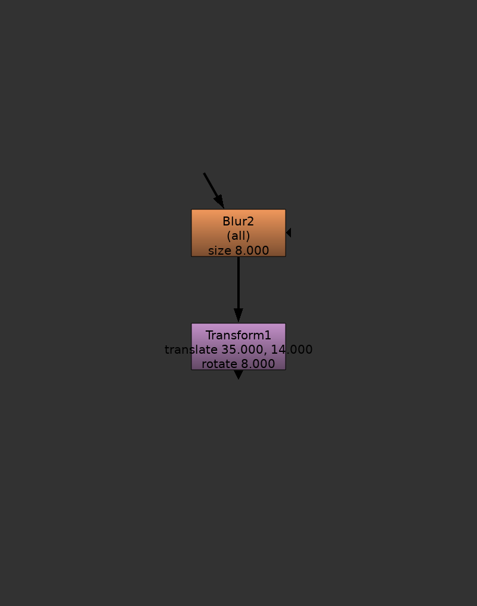
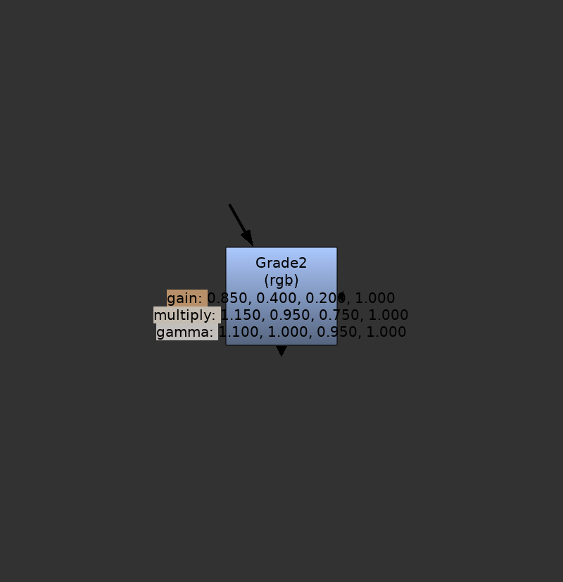
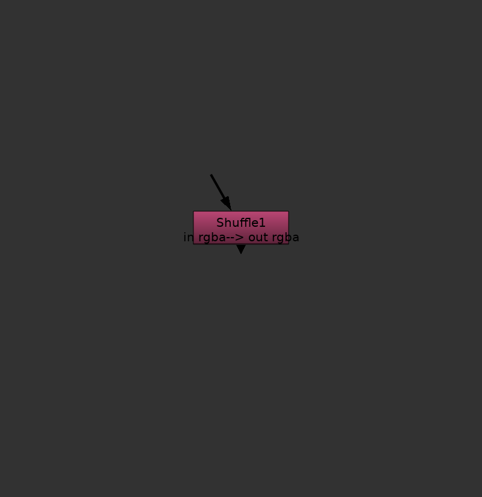
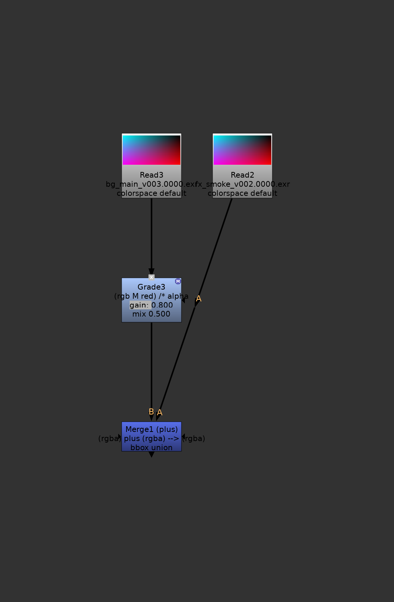
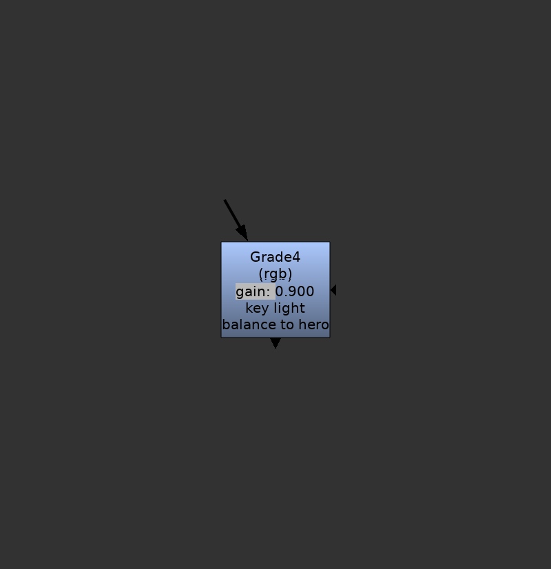
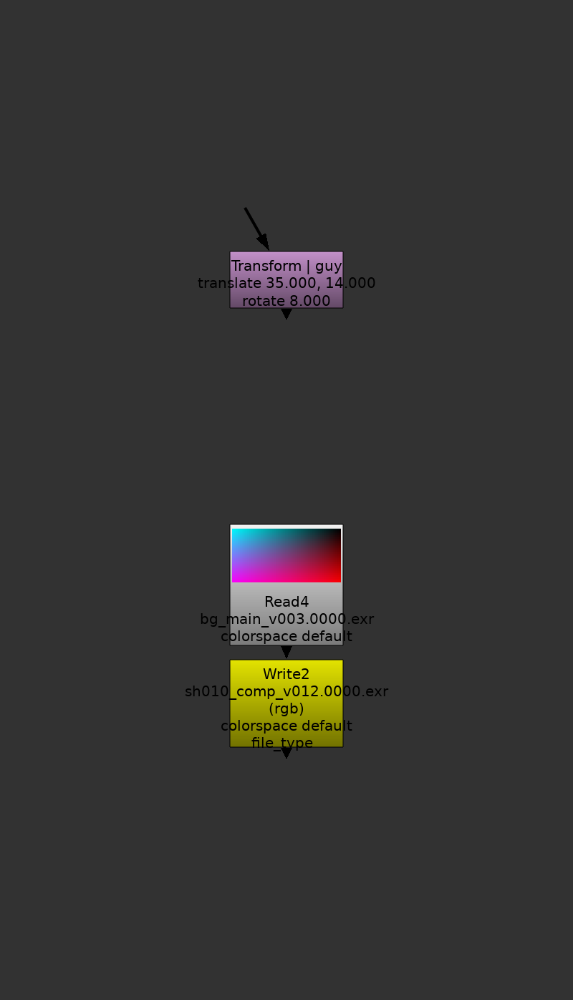
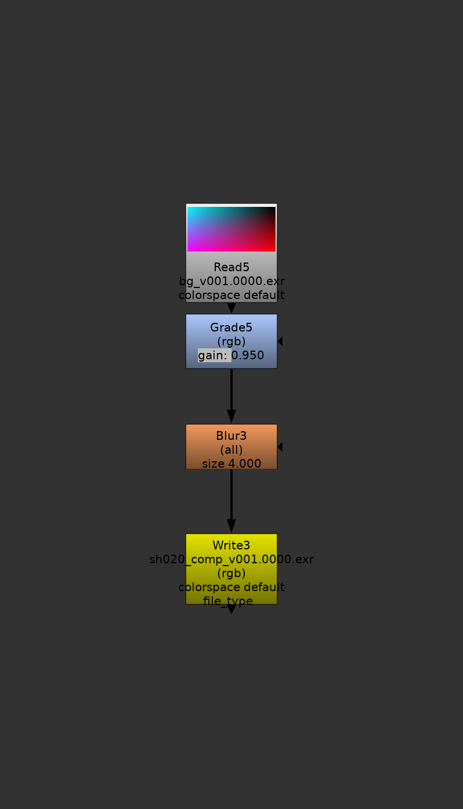
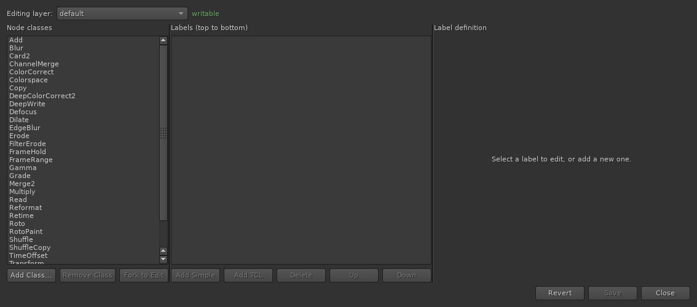
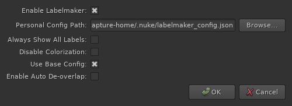

# Labelmaker

Labelmaker is a wholesale replacement for Foundry Nuke's autolabel system, showing you far more information at a glance in the node graph. No more opening the properties panel to see what a node is doing — Labelmaker shows you right in the DAG.



This README is the complete reference. A print-friendly **User Guide** (this document minus the installation section) is built from it as a PDF at `docs/user-guide.pdf` — run `make pdf` to rebuild it — and is bundled in every release.

# Installation

## Single User

Drop the **entire `Labelmaker` folder** (not just individual files) into your `~/.nuke/` directory, then add the following line to your `menu.py`:

```python
nuke.pluginAddPath('Labelmaker')
```

Note: this goes in `menu.py`, not `init.py`. Labelmaker only affects the UI and does not need to load in headless render sessions.

## Facility

Put the `Labelmaker` folder somewhere on a shared location and add it to the Nuke plugin path the same way as above. Artists can then layer their own personal config on top of the shared install — see [Configuration](#configuration).

# Features

## Regular Knob Readout

Labelmaker's core job is to read a node's ordinary knob values and print them right on the tile, so you can tell what a node is doing without opening its properties panel. A Blur shows its `size`, a Transform its `translate` and `rotate`, and so on.



By default a knob line only appears once its value differs from the knob's default, so an untouched node stays clean and an adjusted one announces exactly what changed. You can flip this to always-on in the preferences (see [Always Show All Labels](#preferences)).

## Colour Swatches

See the colour of your grades right in the node graph.



Color and AColor knobs (e.g. in a Grade node) automatically get colour swatches. Labelmaker uses an approximation of the AlexaToRec curve to tonemap colours so even quite bright values stay legible. Swatch text colour adapts for readability. This can be disabled globally in the preferences, or per line with the `colorize` config key.

## Custom TCL in Autolabels



Config entries can include arbitrary TCL strings that are evaluated as if written in the node's label knob. For example, the base config for Shuffle uses `"in [value in]-->out [value out]"`, which displays `in rgba --> out rgba` on the node. This keeps TCL out of the label knob and lets you update the display of every node in every script by editing the config.

## Channels, Masks, Merges and Mix

Labelmaker reads the whole channel story off a node — the channels it operates on, any channel mask, (un)premultiplication, mix, and, for Merge-style nodes, the operation and the channels flowing through it — so you can read a composite without opening a single node.



- **Channels** — any node with a `channels` knob shows the channels it is operating on, e.g. `(rgb)`.
- **Masks and unpremults** — the channel readout reflects masking and (un)premult state:
  - `M` — masked by a channel
  - `Minv` — masked by the inverted channel
  - `/*` — unpremultiplied/premultiplied by a channel

  For example, `(rgb M red) /* alpha` means the node processes `rgb` channels masked by `red` and (un)premultiplied by `alpha`.
- **Merges and channel operations** — a Merge might read `(rgba) plus (rgba) --> (rgba)`; a non-default `also merge`, `bbox`, `metadata from`, or `range from` appears on its own line when it differs from the default. ChannelMerge and Copy get the same treatment for the channels they route.
- **Mix** — when a node's `mix` knob is set to anything other than `1.0`, the current mix value is shown on the node.

## Regular Old Labels

The label knob works exactly as before, including TCL expressions, and is shown alongside Labelmaker's readouts.



## Other Readouts

A few more things Labelmaker surfaces automatically.



- **Node class** — Labelmaker ensures you can always tell what class a node is. If a node has been renamed to something that no longer starts with the class name — for example `Transform1` renamed to `guy` — Labelmaker displays `Transform | guy` so you always know what you're looking at. Nodes that haven't been renamed display normally.
- **File readout** — Read and Write nodes show the basename of their file path directly on the node, so you can identify sources and outputs without opening the properties panel. Write nodes also show their colorspace, file type, and render order when they differ from the defaults.

## Auto De-overlap

When a node's label grows taller (because more knob values come into view), Labelmaker automatically pushes any nodes the grown label now overlaps down to make room, whether or not they are connected to the grown node. Pushed nodes cascade: if pushing a node makes it overlap nodes below it, those are pushed too.

The push is a spatial sweep — nodes are moved based on where they sit in the DAG, not on how they are wired — and it is debounced with a 150 ms delay so a burst of label changes resolves in one pass. It does not pollute the undo stack. Nodes are never retracted when a label shrinks, side-by-side nodes at the same height are left where they are, and pre-existing overlaps elsewhere in the script are left alone. Backdrops and Viewers are skipped. This feature can be toggled in preferences.

## De-overlap All Nodes

**Edit > Node Layout > De-overlap All Nodes** runs a one-shot spatial sweep across the entire script. Nodes are processed in top-to-bottom order; any node whose bounding box overlaps the node above it is pushed down to clear it, and the push cascades to nodes below. Unlike the automatic push, this operation is fully undoable.



This is especially handy the first time you open an existing script after enabling Labelmaker: because the new labels are taller than Nuke's defaults, nodes that used to sit clear of one another may now overlap, and a single De-overlap All pass tidies the whole script at once.

# Configuration

Labelmaker reads one or more JSON config files. Each top-level key is a node class name; its value is a list of line definitions displayed in order.

```json
{
    "NameOfNodeClass": [
        {
            "name": "knob_name",
            "label": "optional display label",
            "default": "optional — omit line when value equals this (use a list for multi-value knobs, e.g. [0.0, 0.0])",
            "always_show": true
        },
        {
            "tcl_string": "[value in] --> [value out]"
        }
    ]
}
```

Keys for knob entries:

| Key | Required | Description |
|---|---|---|
| `name` | yes | Internal knob name |
| `label` | no | Display label shown in the DAG |
| `default` | no | Skip this line when the knob is at this value |
| `always_show` | no | Show this line even when the value matches `default` |
| `colorize` | no | Color/AColor knobs are colourised by default; set `false` to disable for a line |
| `tcl_string` | — | Alternative to `name`; raw TCL evaluated in node context |

The shipped `base_config.json` already covers many common classes — Read, Write, Grade, Transform, Blur and other filters, Merge2, ChannelMerge, Copy, Shuffle, Reformat, ColorCorrect, Retime, FrameRange, Roto/RotoPaint, and more — so most scripts show rich labels out of the box. A personal config at `~/.nuke/labelmaker_config.json` (or the path set in preferences) layers on top of it; because overriding happens at the node-class level, defining a class in your personal config replaces that whole class definition rather than merging line by line.

## Config Editor

Open the editor via **Edit > Labelmaker Config Editor...** to add and tune labels through
a GUI instead of hand-editing JSON. It's a floating, non-modal window, so you can keep
working in the DAG while it's open.



- Pick which layer to edit from the **Editing layer** dropdown. Read-only layers (such as
  a base config on a shared install) are shown as `READ-ONLY` and can be browsed but not
  changed.
- Each node class shows where it sits in the cascade — `overrides ...`, `overridden by ...`,
  or, for a class defined only in a lower layer, a greyed-out **inherited** row.
- To customize an inherited class, select it and click **Fork to Edit** (or double-click it).
  This copies the whole class definition into the layer you're editing so you can override
  it. Because configs replace whole classes, your copy then fully controls that class.
- Add, delete, and reorder labels per class, switching freely between simple knob readouts
  and TCL labels.
- **Save** writes the layer to disk and reloads the live autolabeller, so changes apply
  without restarting Nuke. If your personal config doesn't exist yet, saving creates it.

## Preferences

Open the preferences dialog via **Edit > Labelmaker Preferences...**



| Preference | Default | Description |
|---|---|---|
| Enable Labelmaker | on | Master on/off switch. When off, Nuke's default autolabel is restored. |
| Always Show All Labels | off | Show all config lines regardless of whether values are at their defaults |
| Disable Colorization | off | Turn off colour swatches |
| Use Base Config | on | Include the shipped `base_config.json` |
| Enable Auto De-overlap | on | Automatically push overlapped nodes down when a label grows taller |
| Personal Config Path | `~/.nuke/labelmaker_config.json` | Location of your personal config overrides |

Preferences are saved to `~/.nuke/labelmaker_prefs.json` and apply immediately.

# Caveats

## Node Heights Change

By default, knob lines are hidden until the value differs from the default. This makes it easy to see at a glance which knobs have been adjusted, but nodes change height as you edit them.

If this bothers you, enable **Always Show All Labels** in the preferences. Nodes will be a consistent (taller) height at the cost of being more verbose and less scannable.

## Performance

Labelmaker has been used on production scripts of substantial size without issue. The autolabel routine runs as a low-priority idle process. If you do encounter performance problems, please open a GitHub issue and include the approximate node count and any node class that seems to be the culprit.
